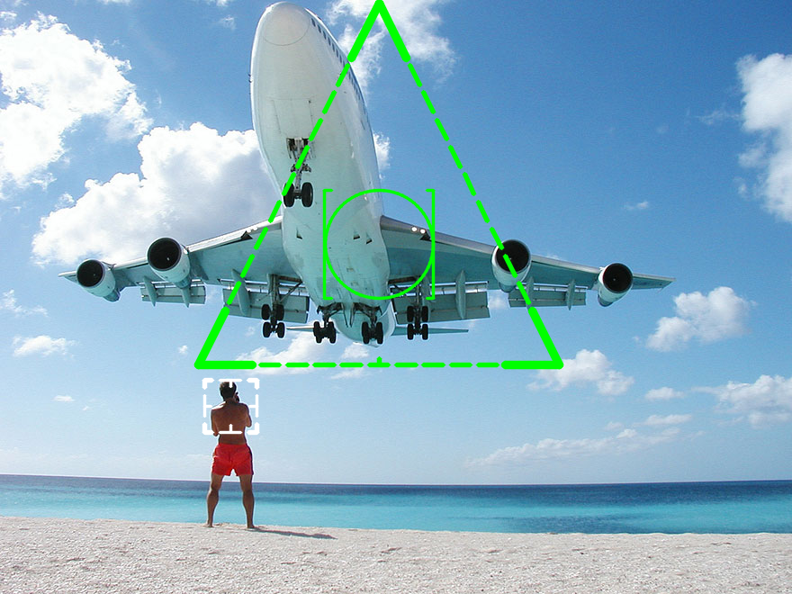
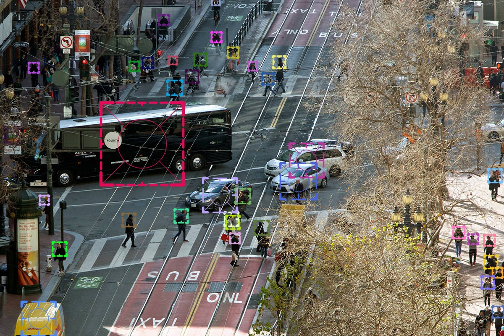
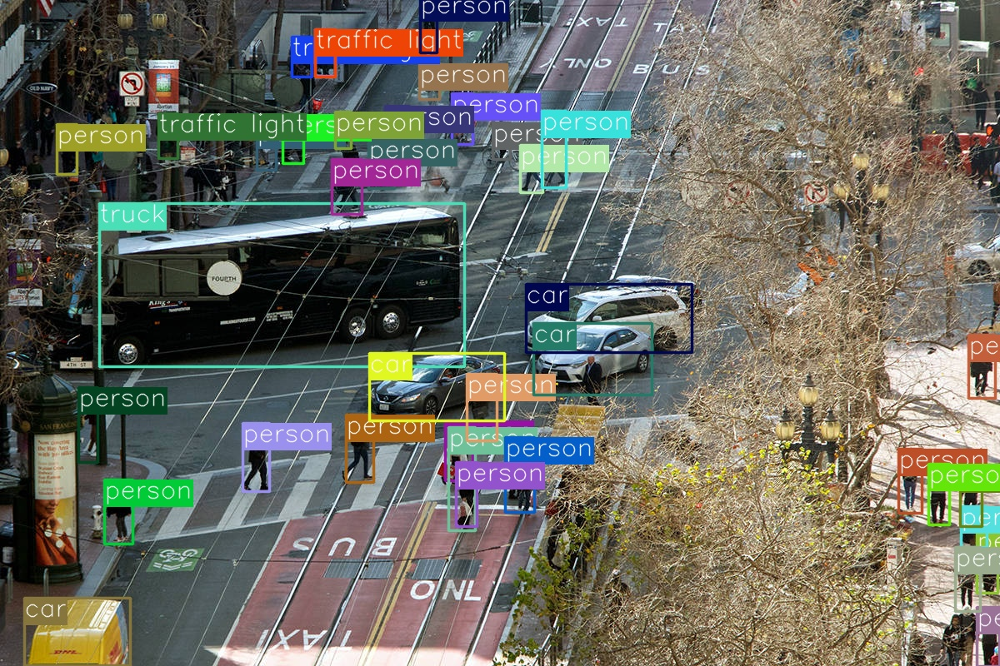

# The Machine



## Introduction
The Machine is a C++ inference-only implementation of [YoloV5](https://github.com/ultralytics/yolov5) using LibTorch with a nice UI inspired by the TV Show "Person of Interest".

The code is split into smaller projects so they can be easily reused:
- ``WeightsLoading``, a simple utility that is used to load trained weights directly from python ``.pt`` files without converting the model with torch.jit
- ``YoloV5``, the network implementation. Not all layers present in the original YoloV5 repo are implemented, only the one used in the most recent released architectures. Uses [rapidyaml](https://github.com/biojppm/rapidyaml) to read the network architecture file (included in this project as a submodule).
- ``TheMachine``, the main executable, calls ``YoloV5`` and display the results using [OpenCV](https://github.com/opencv/opencv).

## Building

```bash
git clone --recursive https://github.com/adepierre/TheMachine.git
cd TheMachine
mkdir build
cd build
cmake ..
make all
```

You might have to specify ``-DTORCH_DIR`` and ``-DOpenCV_DIR`` if these libraries are not found automatically by cmake.

## Running the Machine

Once compiled, the main executable should be present into ``/bin``. Before running the detector, you have to download a model from Ultralytics official repo. You need a ``.yaml`` [model file](https://github.com/ultralytics/yolov5/tree/master/models) and the corresponding ``.pt`` [weights file](https://github.com/ultralytics/yolov5/releases). Once you've got these two files, you can run the program using the following line:

```bash
TheMachine --model yolov5s.yaml --weights yolov5s.pt --path ../data/zidane.jpg --simple_ui
```
You should see the output of the detection displayed on screen.

The arguments you can pass to the program are:
- ``model``, the path to the ``yaml`` file you want to use
- ``weights``, the path to the ``.pt`` file with the trained weights
- ``path``, the path to the image you want to process. Any image format supported by OpenCV should work.
- ``save``, an optional path to save the output image
- ``gpu``, if set, will try to use the GPU instead of the CPU
- ``simple_ui``, if set, will use a "vanilla" display with a rectangle and the detected class name instead of the PoI inspired one. As the machine is only interested in some classes (person, car, truck, bus, airplane, boat and train), this is required if you want to detect the other 73 classes like broccoli or hot dog. Here is an example of the two different UI mode.
    



## Future

This was just a project I did for fun on my spare time, but I still have quite a few ideas to improve things. Here is a list without any idea on when or if I'll implement them in the future:

- more input format, supporting videos/webcam/YT videos or internet streams
- add an option for processing large images by splitting them in smaller images with overlap
- adding a tracking network, to follow a target in a video
- adding a deep speech to text model, to monitor phone calls
- other fun things?

## License

This repo is under MIT license, however, Ultralytics repo is under GPL3. I don't think this is a problem, as no code from their repo is directly used. But if you're using their ``yaml`` and ``pt`` files instead of your own, you might have to also respect their GPL3 license (I'm not a lawyer, I might be wrong).
